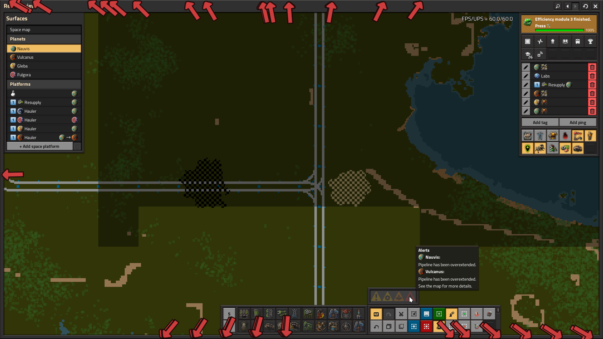

# Better Alert Arrows

Changes the Factorio alert arrow graphics to look like the pin arrows, and adds customizable tint and scale.

## Installation

Download and install from the [mod portal](https://mods.factorio.com/mod/BetterAlertArrows).
